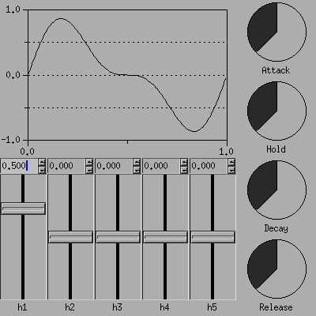

# Minisynth

This is a simple midi synthesizer wich produces sinus based sounds. Currently it
only supports jack, but support for other audio systems is planned.

## Dependencies

* [jack2](https://jackaudio.org/)
* [xforms](http://xforms-toolkit.org/) (only for gui)

## Features

* 128x Polyphony
* controlls for 5 harmonics and envelope

## Design goals

* Isolate sound system code (like creating a jack client) from
  synthesizer code, thus
  - Make it easy to add other sound systems (eg. portaudio)
  - Make it easy to change the synthesizer code
* Easyly understandable and readable code
* Platform independent code (at least for the cli)
